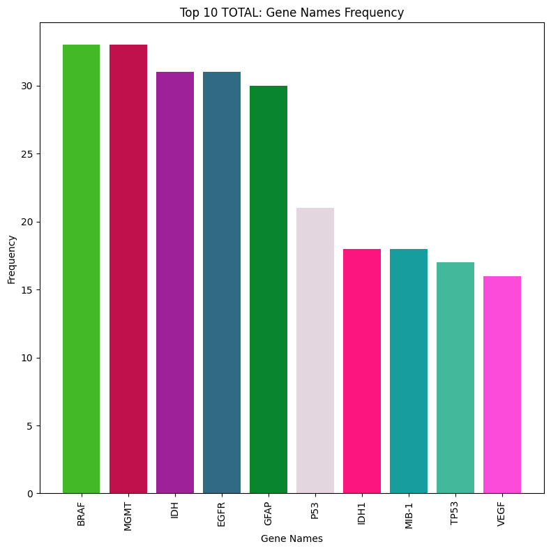
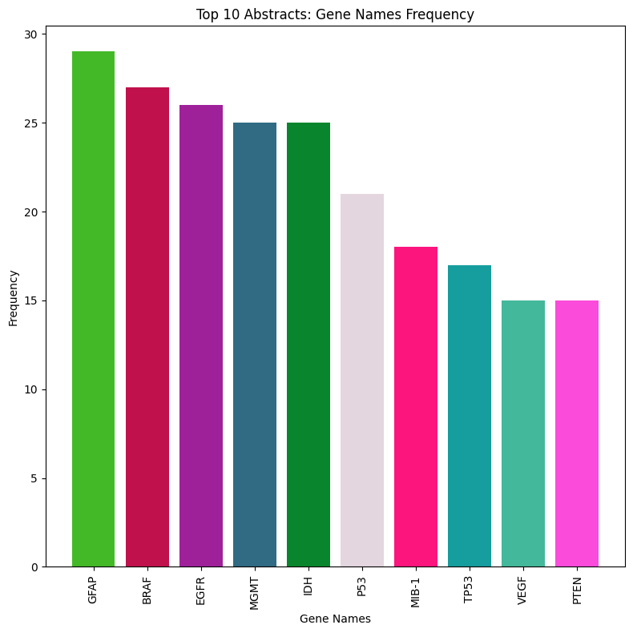
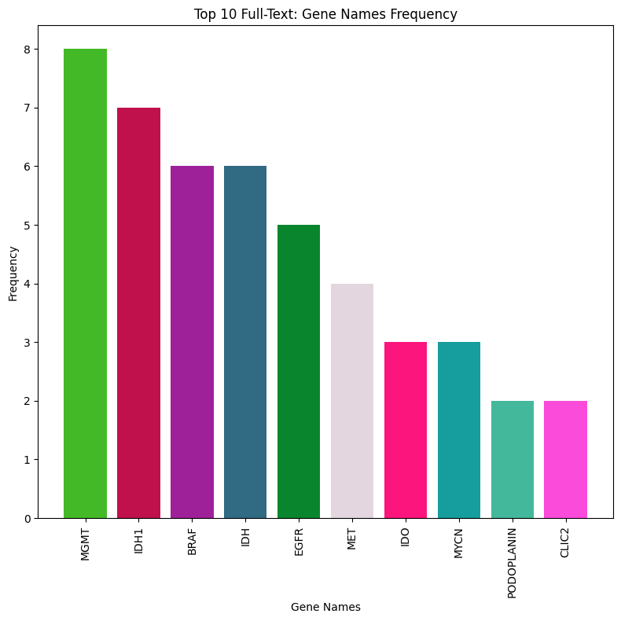
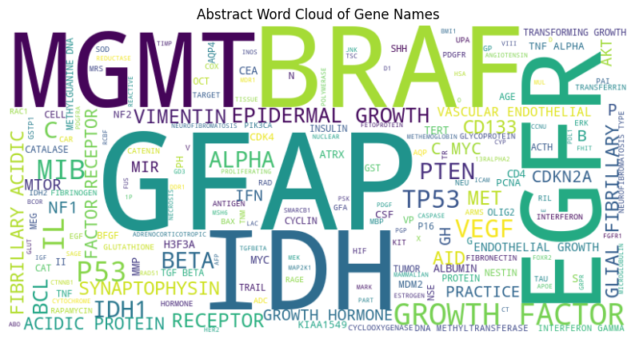
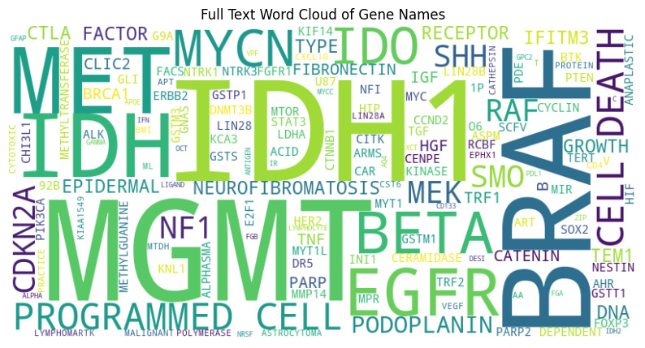
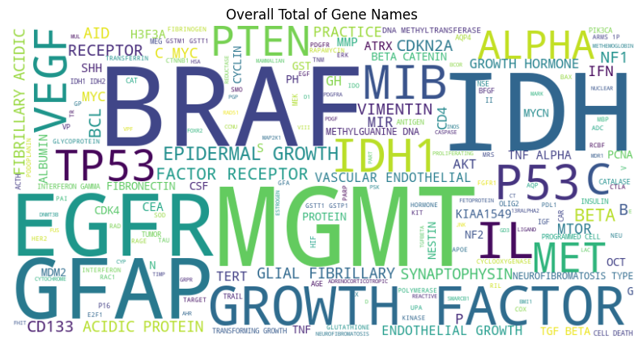

# Analyzing Science Articles: Identifying Genes Associated with Brain Tumors
**Author: Julia C.**

**Warning: The information presented in this website is an on going senior research project, and the information will be pieriodically updated.**


## *Objective*
The objective of the project is to identify genes associated with brain tumors, providing insight into genetic factors linked to brain tumor development and prognosis through mentions in biological article's and their abstracts.

## Based on Senior Research Paper
Here is the link to the paper: [Senior Research Paper](For github/GenesAssociatedwithBrainTumors.docx.html)

## Table of Contents
- [Background](#background-on-the-data-resource-and-brain-tumors)
- [Results](#results)
- [Code and Description of the Code](#code-described-in-the-methodology-section-in-the-paper)
- [References](#references)
<a name="headers"/>

## *Background On The Data Resource and Brain Tumors*
Brain tumors cause serious, life-threatening diseases, for they are abnormal cell growths [2]. There are several factors that can lead to  abnormal cell growth, and researchers are looking at genetic and molecular changes in a person's cell to understand why there was a change in cells that caused them to start growing abnormally, which in turn caused the tumors [3]. Genes are the building blocks of life; they are segments of DNA that determine how an organism looks, behaves, and survives in environments or places they are in [4]. Diagnosing brain tumors can be done through various tests, one being an MRI scan with a gadolinium enhancement that examines the brain, looking for any indications of abnormalities [2]. Brain tumors can either be benign or malignant. Benign tumors stay put and do not travel to other parts of the body, unlike malignant cancerous tumors that can spread (metastasize) from one part of the body to another [5]. Since benign tumors do not disperse, they are just classified by their look, size, and area in which it is located; however, malignant tumors can be further classified into specific types or histologic (main) categories, which will then sometimes have subcategories which will be placed into a type of grade [5]. Grade I or II are low-grade tumors that grow slowly and are less likely to cause nearby tissues to become tumors, and higher-grade tumors, grade III or IV, will grow quickly and cause other tissues to become tumors [5]. The likely hood on developing a primary cancerous brain tumor is less than 1%, however it is estimated that around 5,000 children under 20 will be diagnosed with it in the year 2023 in the United States [6]. The leading cause of death in children and adolescence is cancer, and brain tumors being one of the top 3 cancers [1]. There are so many different types of brain tumors; however, they are hard to diagnose, for they have symptoms like headaches and nausea or vomiting, which other diseases can also cause. These symptoms are why brain tumors in children are often delayed in diagnosis or misdiagnosed, for it could be other ailments [7].  

Studying all tumors' biological, genetic, or mechanical factors is essential to understand how they behave or grow, spread, and react to other tissues in the human body. Understanding the molecular mechanisms of brain cancerous tumors to help improve diagnosis and treatment to help decrease the disease's mortality [8]. Studying the mechanics of the tumors will help researchers learn more about why tumors in the brain happen and learn other things, like how the genetics of the tumors can be different due to mutations, which will affect the locations in which they develop in a person [5]. Mutations (i.e., changes in DNA sequence) can lead to malformation of proteins that cannot perform their duties as they are meant to, leading to genetic disorders or even diseases like cancer [4]. Studying tumor genes and associated genes will help researchers understand what makes a tumor different from normal tissue. If they find what causes the tumor, they can create more effective treatments that will target the cause of the tumor and save lives. 

Researchers share their findings through research articles, which are published and can be accessed through various web platforms such as PubMed (https://pubmed.ncbi.nlm.nih.gov/). PubMed is a literature-based resource where scientific papers and other resources can be found and is one of many resource systems in the National Library of Medicine: National Center for Biotechnology Information (NCBI) government website. PubMed articles and their abstracts can be accessed through the PubTator Central platform, or PubTator for short, a free online resource that provides bio information using PubMed articles. PubTator is a system that highlights six biomedical concepts mentioned in PubMed article abstracts, which are summaries of research articles [9]. A user can obtain PMIDs (PubMed IDs) of articles by saving an article in a collection by clicking the heart icon underneath the article title and author names. There are well over 30 million pieces of biomedical literature that PubTator can access, and there are various categories under biomedical, with brain tumors being one [9]. The point of this tool is to help researchers in many ways, like making it easier to identify genes, diseases, chemicals, and other biomedical concepts to help researchers analyze important information in various numbers or research articles and find related work on biological topics quickly. Suppose researchers want to download data on the biochemicals. In that case, they can use the PubTator API platform, where following the instructions will obtain data and is the main reason PMIDs are important. PubTator helps provide data that researchers can analyze. 

The project aimed to identify genes associated with brain tumors, providing insight into genetic factors linked to brain tumor development and prognosis, through mentions in biological articles and their abstracts. PubTator was the source from which data was obtained for the project, and it contained research articles on studies done regarding brain tumors (Note: the experiment used Python in Jupyter Notebook environment to analyze the data). The project's outcome will help other researchers learn what genes are associated with brain tumors, which could lead to future research on the most frequently referenced gene in brain tumors. In addition, it will help educate researchers new to studying brain tumors on what genetic information has been discovered and what has been most focused on based on the number of times the gene name is referenced. Understanding genes associated with brain tumors will help other research topics focus more on certain types of genes that have the potential for better treatment plans.

## Results
In this section lays the results of the experiment, remember the objective of the experiment was to identify genes associated with brain tumors, providing insight into genetic factors linked to brain tumor development and prognosis through mentions in biological article's and their abstracts. 

For the experiment, 1,100 samples were examined, and around a total of 736 gene names were referenced. However, split between abstracts and full-text around 656 genes were mentioned in the abstracts and 136 in full-text. **Table 1** is the complete frequency table ([^1]) that contains all the gene names referenced in order from highest frequency (*the most mentioned*) to the lowest and at the top displaying the total number of genes in the table and the amount of genes that are unique (*only mentioned once*).
[^1]: It is the combination of abstract and full-text data together.
**Table 1:** [Complete Frequency Table Total](For github/full_total_table.html) ([^2])
**Table 1:** The complete frequency table containing the combination of abstracts and full-text date.

[^2]: In some visualizations the title will reference to Total or TOTAL, which just means the total gene names data (*combination of abstracts and full-text*).

**Table 2** displays the top 10 gene names from **Table 1**. Both tables show there were two genes that were the most mentioned, BRAF and MGMT. For a better view of the most mentioned genes overall, a bar graph (see **Graph 1**) was made, and it is a great visualization of BRAF and MGMT being referenced 33 times. The first 5 gene names mentioned were all in the thirties, with the first and second (BRAF and MGMT) having the same number, 33, and the third and fourth (IDH and EGFR) having the frequency of 31. 
**Table 2:** [Top 10 Total Gene Names](For github/Complete_Top10_FreqTable.png)
**Table 2:** Displays the top 10 most frequently mentioned genes.

**Graph 1:**
**Graph 1:** The graph displays the top 10 most frequenly mentioned genes shown in **Table 2**.

**Graph 1** displays that the first 4 gene names are tide in first and second place. It also shows that the number of mentions from the first rank genes names is almost 2 times more than the last in the top 10, VEGF.

However, when abstracts and full-text are separated the gene names most mentioned changes. **Table 3** displays the complete table of all the abstracts data, with the gene names referenced in order from highest frequency (*the most mentioned*) to the lowest and at the top displaying the total number of genes in the table and the amount of genes that are unique (*only mentioned once*).
**Table 3:** [Complete Frequency Table for Abstacts](For github/full_abstract_table.html)
**Table 3:** The complete frequency table containing the abstracts data.

**Table 4:** [Top 10 Abstracts Frequency Table](For github/Abstracts_Top10_FreqTable.png)
**Table 4:** Displays the top 10 most frequently mentioned gene names in abstract data alone.

**Table 4** displays the top 10 gene names from **Table 3**. For abstracts, GFAP was mentioned 29 times and is ahead of BRAF by only 2. For a better visualization that GFAP was the most mentioned in the abstract data a bar graph (**Graph 2**) was made. 
**Graph 2:**
**Graph 2:** The graph displays the top 10 most frequently mention genes shown in **Table 4**.

Additionally, in full-text alone, the MGMT was the most referenced with being mentioned only 8 times (see **Table 5 and 6**). 
[Complete Frequency Table for Full-Text](For github/full_full-text_table.html)









## Code Described in the Methodology Section in the Paper
```python
# Step 1: Read the text file and extract ID numbers
file_name = 'Gene and Diseases proper pmids.txt'
id_num = []

with open(file_name, 'r') as file:
    for line in file:
        line = line.strip()
        if line:
            id_num.append(line)
            
# Step 2: Create a set to store the ID 
#     numbers for quick uniqueness checks
id_set = set()
duplicate_ids = []

# Step 3: Check for duplicates
for id_number in id_num:
    if id_number in id_set:
        duplicate_ids.append(id_number)
    else:
        id_set.add(id_number)
# Output
if not duplicate_ids:
    print("No duplicates found.")
else:
    print("Duplicates:")
    for id in duplicate_ids:
        print(id)
```

## References
> [1]	“Cancer Facts & Figures 2023,” Am. Cancer Soc., 2023. Pages 12 and 14. [Online]. Available: https://www.cancer.org/content/dam/cancer-org/research/cancer-facts-and-statistics/annual-cancer-facts-and-figures/2023/2023-cancer-facts-and-figures.pdf 

> [2]	L. M. DeAngelis, “Brain Tumors | NEJM,” The New England Journal of Medicine. Accessed: Oct. 03, 2023. [Online]. Available: https://www.nejm.org/doi/full/10.1056/NEJM200101113440207

> [3]	“What causes brain tumours?,” The Brain Tumour Charity. Accessed: Oct. 12, 2023. [Online]. Available: https://www.thebraintumourcharity.org/brain-tumour-diagnosis-treatment/how-brain-tumours-are-diagnosed/brain-tumour-biology/what-causes-brain-tumours/

> [4]	“Genes: Function, makeup, Human Genome Project, and research.” Accessed: Oct. 12, 2023. [Online]. Available: https://www.medicalnewstoday.com/articles/120574

> [5]	“Types of Brain and Spinal Cord Tumors in Children.” Accessed: Oct. 03, 2023. [Online]. Available: https://www.cancer.org/cancer/types/brain-spinal-cord-tumors-children/about/types-of-brain-and-spinal-tumors.html

> [6]	“Brain Tumor - Statistics,” Cancer.Net. Accessed: Dec. 05, 2023. [Online]. Available: https://www.cancer.net/cancer-types/brain-tumor/statistics

> [7]	A. L. Albright, “Pediatric brain tumors,” CA. Cancer J. Clin., vol. 43, no. 5, pp. 272–288, 1993, doi: 10.3322/canjclin.43.5.272.

> [8]	M. Zhao, Y. Liu, G. Ding, D. Qu, and H. Qu, “Online database for brain cancer-implicated genes: exploring the subtype-specific mechanisms of brain cancer,” BMC Genomics, vol. 22, no. 1, p. 458, Jun. 2021, doi: 10.1186/s12864-021-07793-x.

> [9]	C.-H. Wei, A. Allot, R. Leaman, and Z. Lu, “PubTator central: automated concept annotation for biomedical full text articles,” Nucleic Acids Res., vol. 47, no. W1, pp. W587–W593, Jul. 2019, doi: 10.1093/nar/gkz389.
